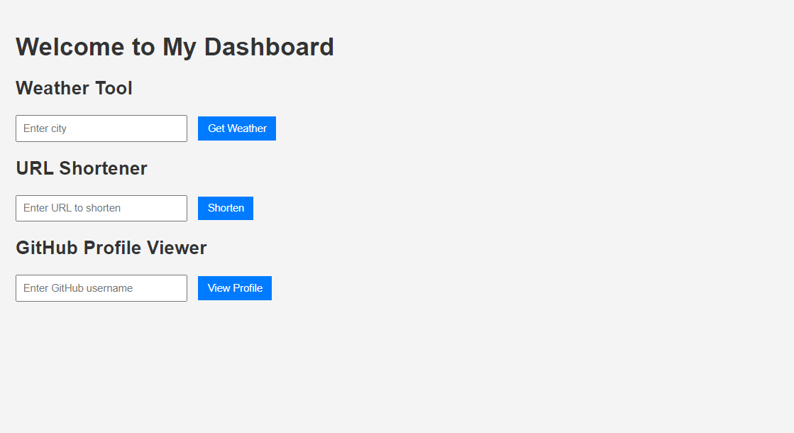

# Dashboard for CLI Tools

This project is a web-based dashboard that integrates several command-line interface (CLI) tools, including a weather CLI, a URL shortener, and a GitHub profile viewer. The dashboard provides a user-friendly web interface to access these tools directly in a browser.

## Setup

To get started with the project, follow these steps:

1. **Clone the repository**:
   ```bash
   git clone https://github.com/MRQ67/dashboard.git
   cd dashboard
   ```

2. **Install dependencies**:
   ```bash
   go mod tidy
   ```

3. **Set up Your API KEY**:
   - You need to obtain your own API key from [OpenWeatherMap](https://openweathermap.org/api) for the weather functionality to work.
   - Added your API KEY to tools/weather.go on line 32 in place of "your-api-key-here"

    ```go
	url := fmt.Sprintf("http://api.openweathermap.org/data/2.5/weather?q=%s&appid="+"your-api-key-here", encodedCity)
    ```

    _Note: I should have used environment variables for the API key but i couldn't get it to work!_


## Running the Application

Once the setup is complete, start the dashboard by running:
```bash
go run main.go
```

The dashboard will be accessible at `http://localhost:8080` in your web browser.

## Example of the Interface



## Features

The dashboard includes the following tools:

- **Weather CLI**: Enter a city name to retrieve current weather information.
- **URL Shortener**: Input a URL to generate a shortened version.
- **GitHub Profile Viewer**: Provide a GitHub username to view profile details.

Each tool is available through a simple form on the dashboard interface.

## Styling

The CSS in this project is intentionally simple and minimal. I focused on functionality over looks, so the design prioritizes usability and performance rather than a polished visual appearance.

## Notes

- A stable internet connection is required for the API calls to function properly.
- The weather feature will not work unless you correctly set your own OpenWeatherMap API key in the program.
- This project serves as a proof-of-concept for integrating CLI tools into a web interface and may need additional enhancements for production use.
